# 🛠️ Práctica: Recuperación de sistema Debian usando CHROOT desde Kali Live

En esta práctica instalaremos Debian e utilizaremos un Live de Kali Linux para acceder al sistema mediante `chroot`, con el fin de recuperar o reparar el sistema operativo instalado.

---

## 🧱 Instalación de Debian

1. **Seleccionamos el idioma del sistema.**

   

2. **Introducimos la contraseña de superusuario.**

   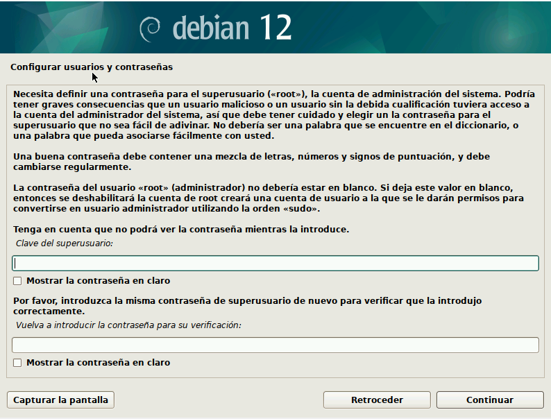

3. **Creamos el usuario del sistema.**

   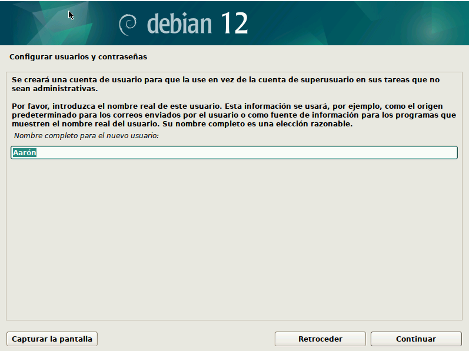
   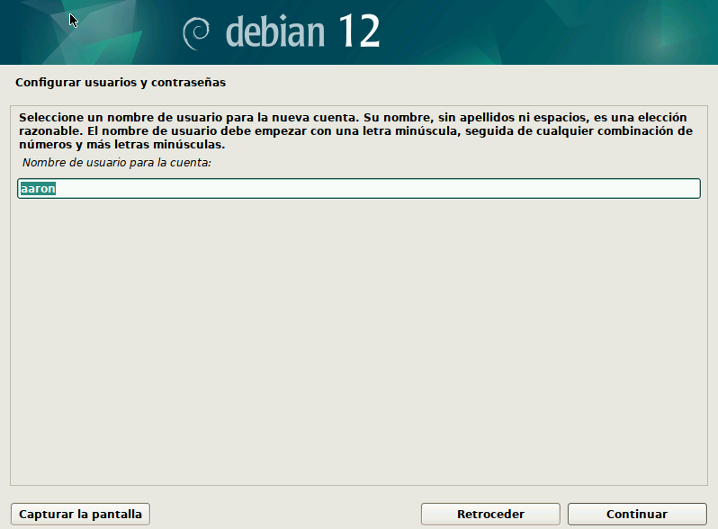
   

5. **Configuramos los discos y particiones.**

   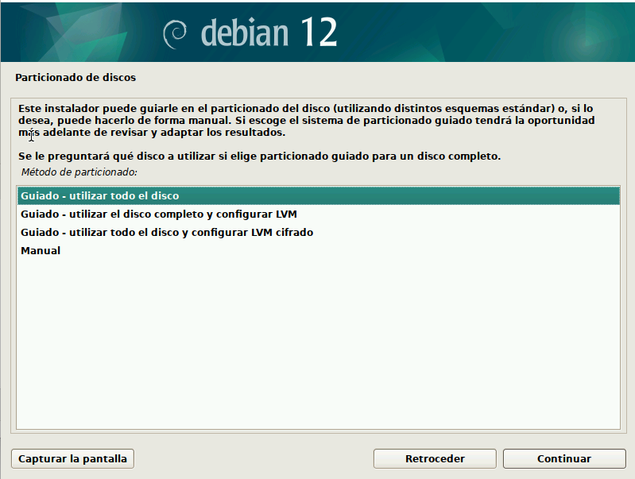
   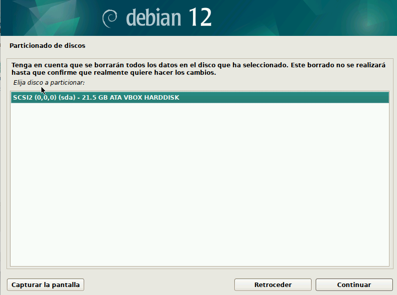
   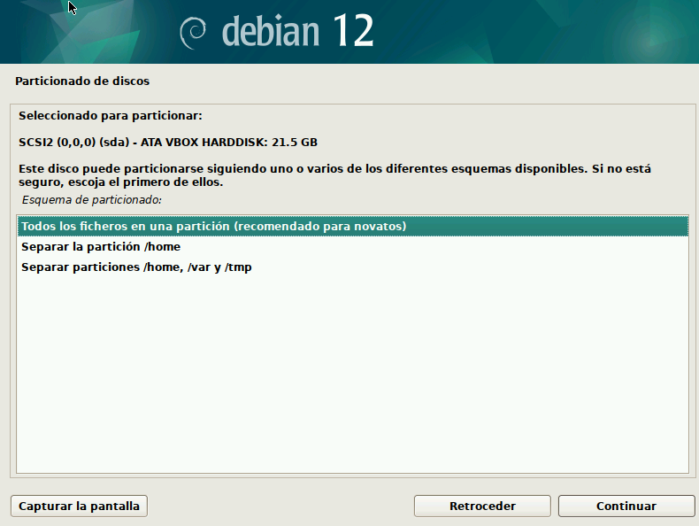
   
   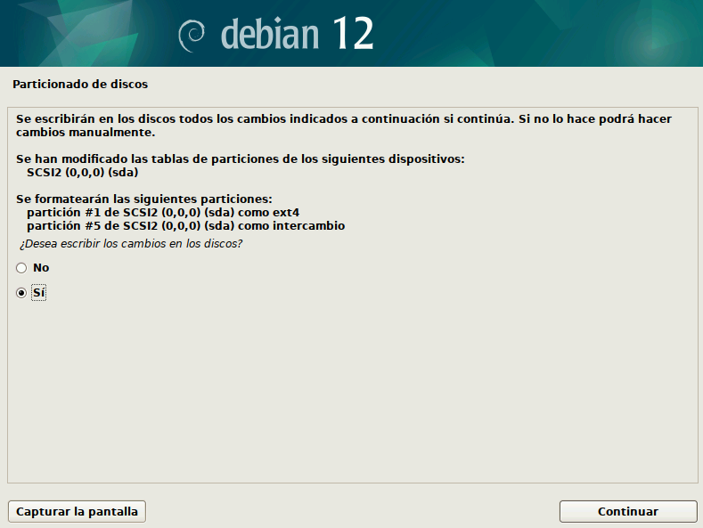
   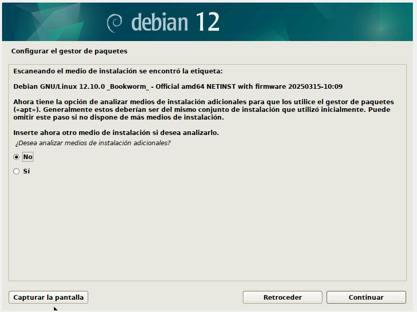
   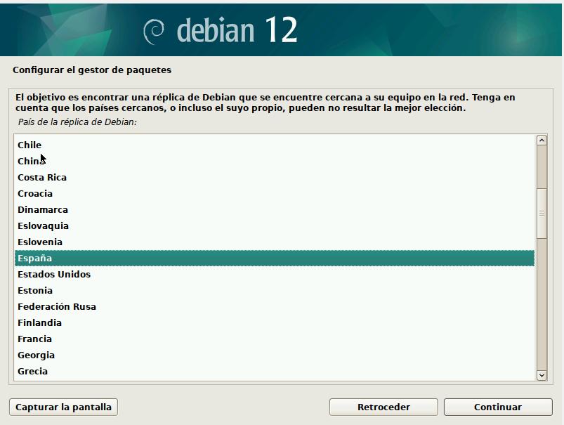
   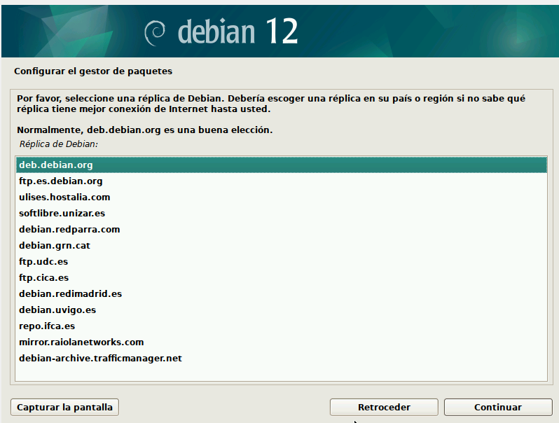
   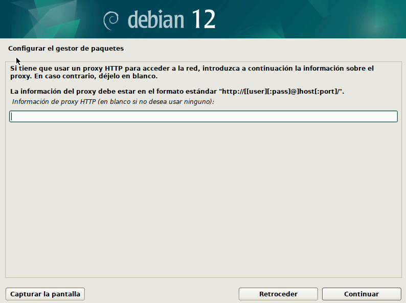
   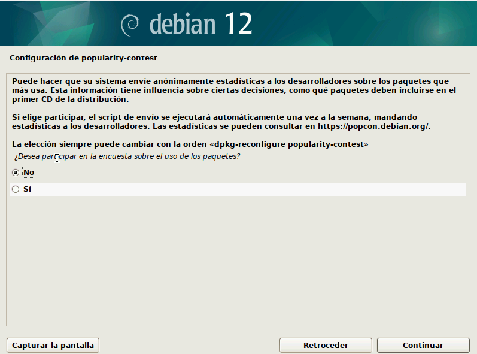
   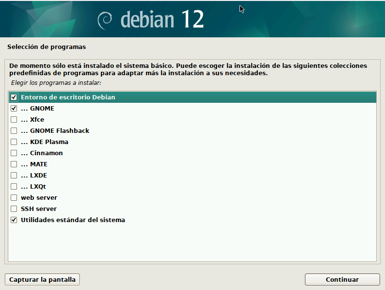
   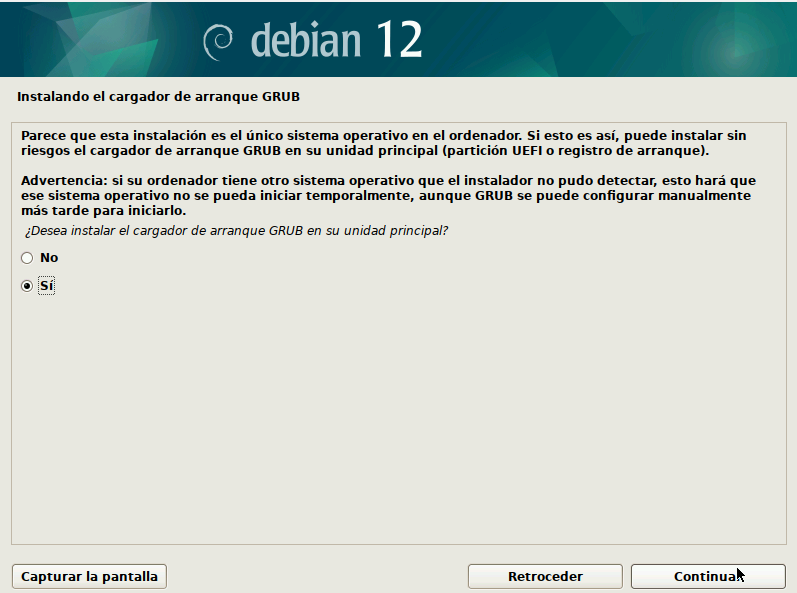
   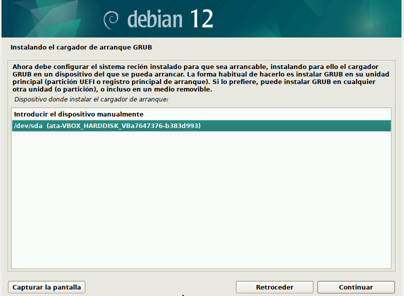

---

## 💿 Arranque de Kali Live

1. **Insertamos el Live USB o ISO de Kali Linux.**

   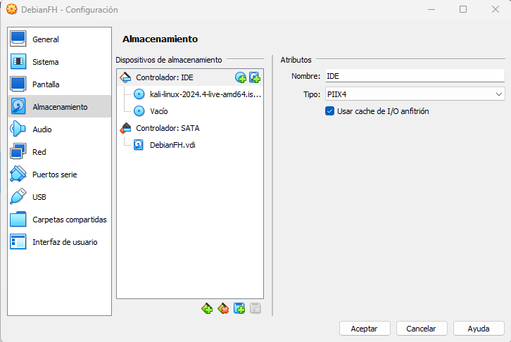

2. **Iniciamos desde el entorno Live de Kali.**

---

## ⚙️ Preparación del entorno en Kali Live

1. **Abrimos una terminal y configuramos el teclado en español:**

   ```bash
   setxkbmap es

2. **Iniciamos sesión como root con "sudo su" y confirmamos en /dev que estea el sda1:**

   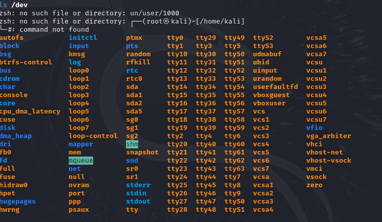
   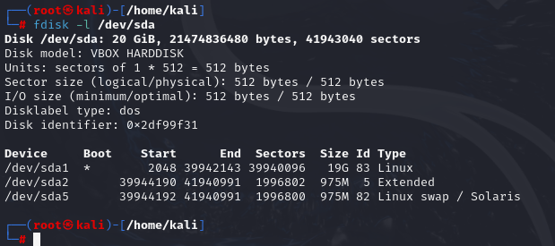

3. **Ahora usamos el "chroot" para modificar el live de Kali para poder entrar en Debian:**

   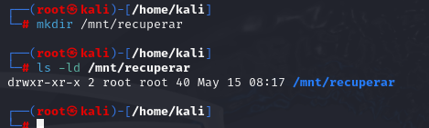

4. **Montamos el disco "/dev/sda1" en "/mnt/recuperar":**

   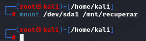
   
   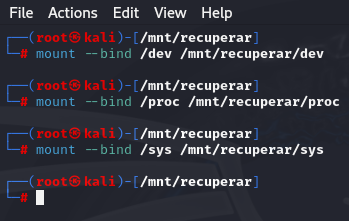
   
   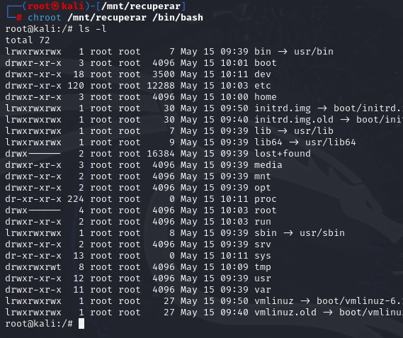

---

## ✅ Verificación

**Creamos un archivo de prueba dentro del entorno Debian montado y luego entramos en el Debian y confirmamos que se creara:**

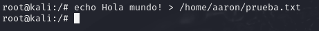

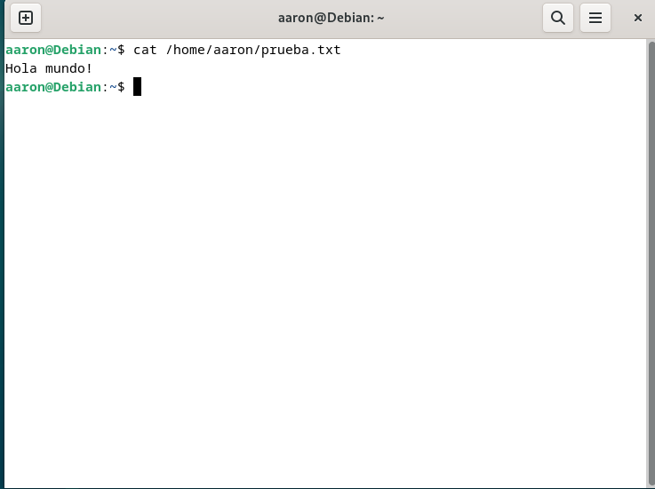
