# Práctica: Configuración de Red Interna en VirtualBox con Netplan y NetworkManager

## Objetivo

Configurar una red interna entre dos máquinas virtuales utilizando IPs estáticas. Se usará Netplan en la Máquina A y NetworkManager en la Máquina B para que la configuración sea persistente.

---

## Paso 1: Crear las máquinas virtuales

Clona una máquina base utilizando **clonación enlazada** para crear dos nuevas máquinas virtuales.

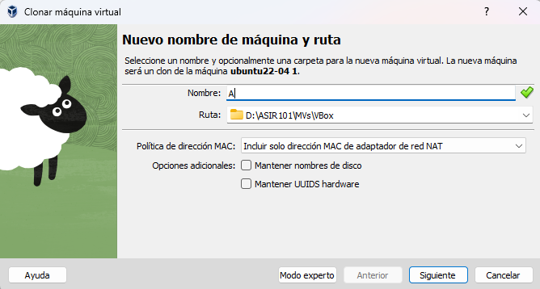
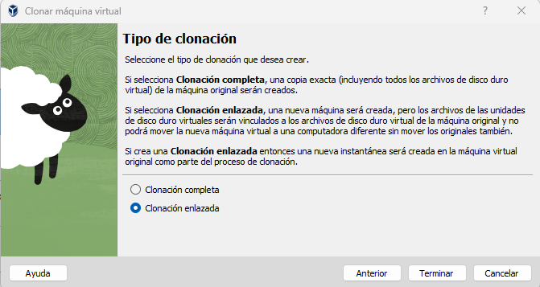
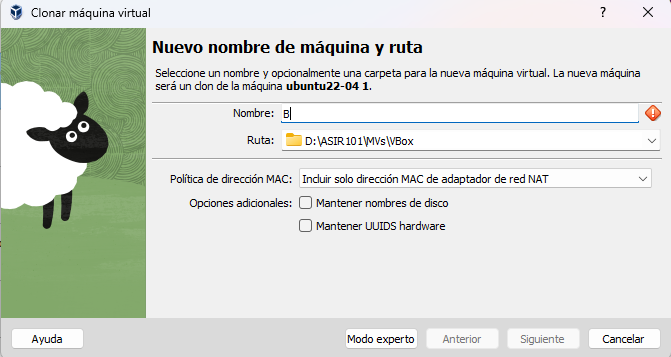

---


## Paso 2: Configurar los adaptadores de red

- Activa el **Adaptador 2** en ambas máquinas.
- Establece el modo de red como **Red Interna**.
- Asigna un nombre, por ejemplo: `Netplan`.

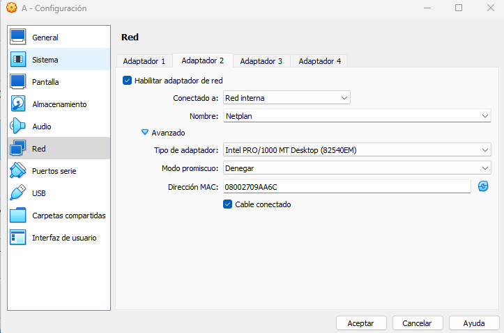

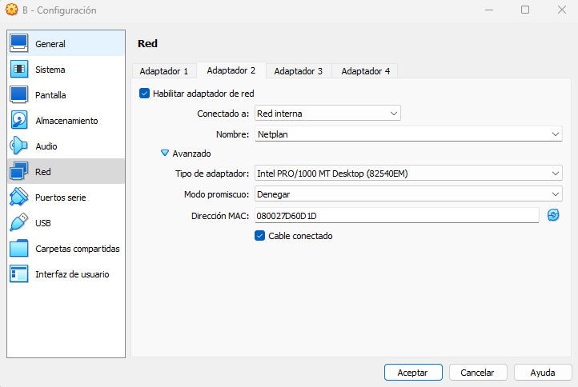

---

## Paso 3: Configurar las interfaces de red `enp0s8`

### En la Máquina A

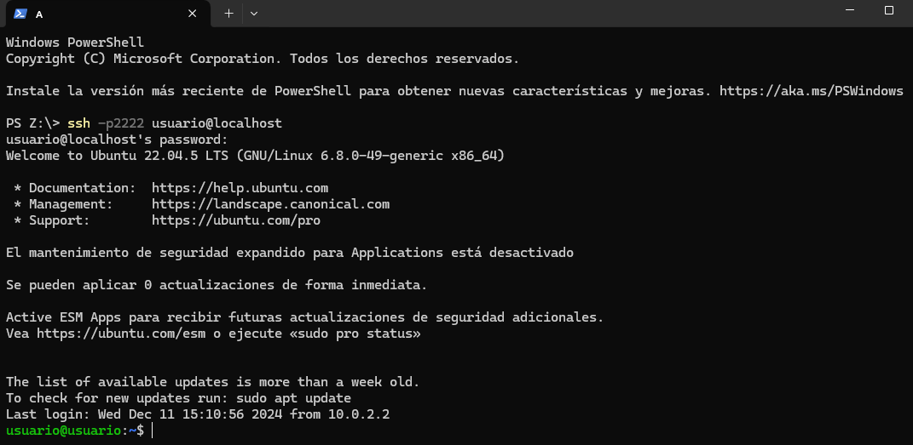

```bash
sudo ip addr add 192.168.100.2/24 dev enp0s8
sudo ip link set enp0s8 up
```
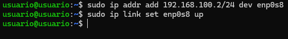

### En la Máquina B

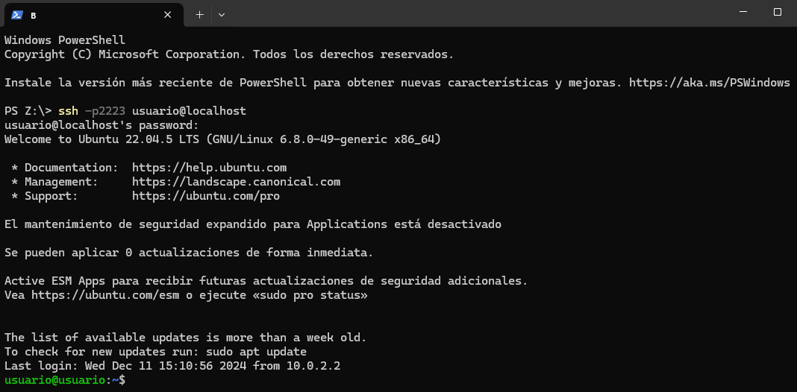

```bash
sudo ip addr add 192.168.100.3/24 dev enp0s8
sudo ip link set enp0s8 up
```
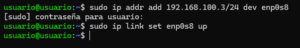

---

## Paso 4: Comprobar conectividad

### Desde Máquina A hacia Máquina B

```bash
ping 192.168.100.3
```


### Desde Máquina B hacia Máquina A

```bash
ping 192.168.100.2
```
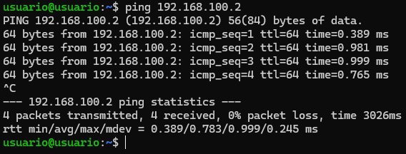

---

## Paso 5: Hacer la configuración persistente

### Máquina A: Usando Netplan

1. Edita el archivo de configuración:

```bash
sudo nano /etc/netplan/01-netcfg.yaml
```
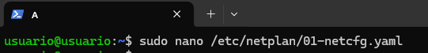

2. Añade el siguiente contenido:

```yaml
network:
  version: 2
  renderer: networkd
  ethernets:
    enp0s8:
      dhcp4: no
      addresses: [192.168.100.2/24]
```
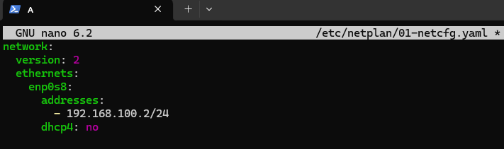

3. Ajusta los permisos:

```bash
sudo chmod 600 /etc/netplan/01-netcfg.yaml
```
  Y aplicamos los cambios
```bash
sudo sudo netplan apply
```

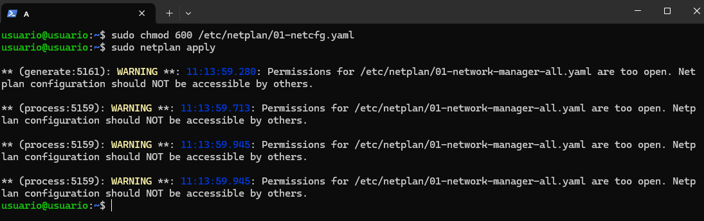

---

### Máquina B: Usando NetworkManager

1. Crea la conexión:

```bash
sudo nmcli con add type ethernet ifname enp0s8 con-name intnet-b ip4 192.168.100.3/24
```

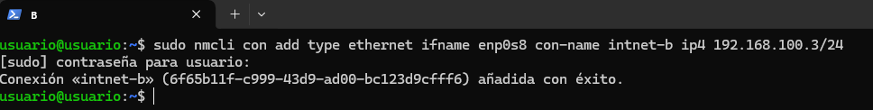

2. Activa la conexión:

```bash
sudo nmcli con up intnet-b
```
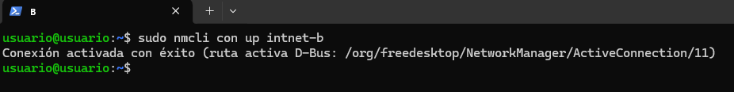

---

## Paso 6: Verificación final

Reinicia ambas máquinas y verifica que:

- La IP se mantiene tras el reinicio.
- La conectividad entre ambas máquinas sigue funcionando mediante `ping`.


---
