# Práctica SSH

## Configuración Inicial

1. Creamos las clonaciones de nuestras máquinas y configuramos los puertos de red:
   - Máquina A: puerto `2222`
   - Máquina B: puerto `2223`

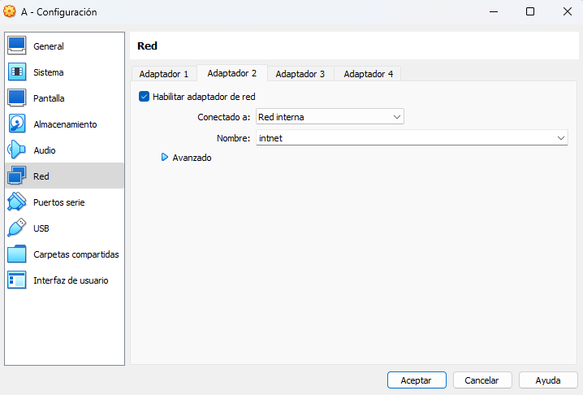
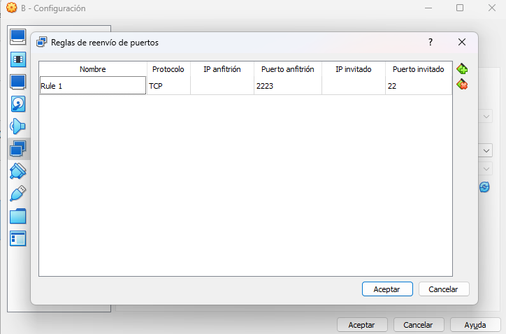

2. Nos conectamos por **SSH** a las dos máquinas.
   
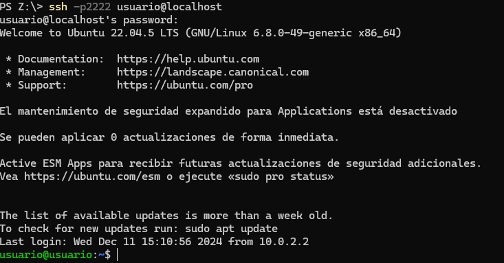
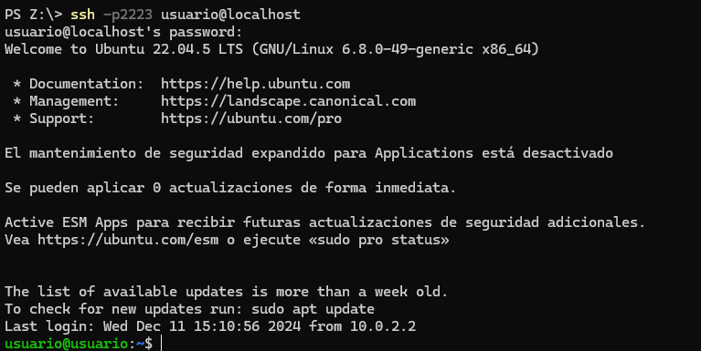

## Creación de Usuarios

- En la máquina **A**, creamos el usuario `Alex`.
  
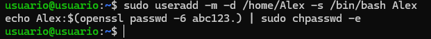

- En la máquina **B**, creamos el usuario `Brais`.
  
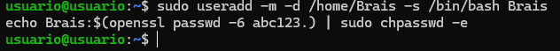

## Configuración de IPs

- Configuramos las direcciones IP en ambas máquinas y verificamos la conectividad con un **ping**.
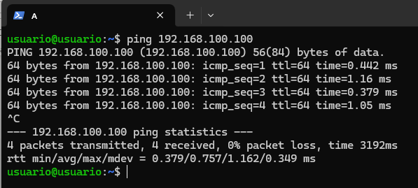

## Conexión SSH entre Máquinas

- Desde la máquina **A**, realizamos una conexión SSH hacia la máquina **B**.

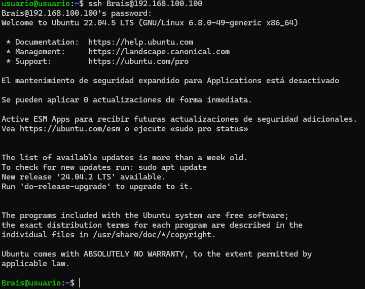

- Al conectarnos, se genera un archivo `known_hosts` en `~/.ssh/` que guarda la huella digital del servidor B.

## Transferencia de Archivos

1. En la máquina **A**, creamos el directorio `prueba` con el archivo `prueba.txt` en la ruta temporal y enviamos la información a la máquina B.

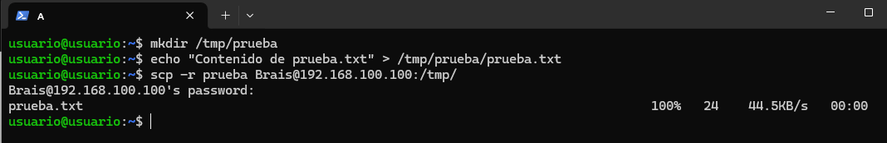

3. En la máquina **B**, creamos el directorio `prueba2` con el archivo `prueba2.txt` en su ruta temporal y lo enviamos al cliente A.

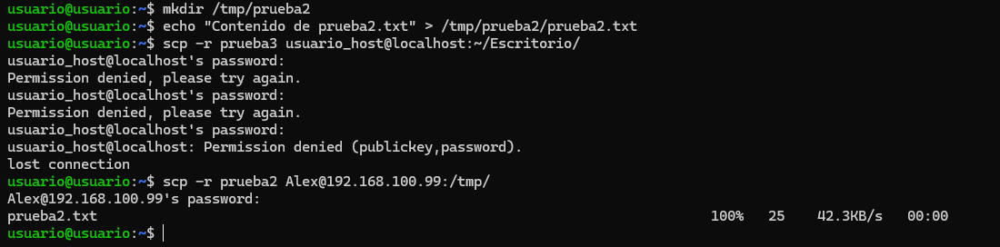

5. Transmitimos los directorios `prueba` y `prueba2` al ordenador anfitrión. Ejecutamos los comandos necesarios desde la máquina anfitrión.

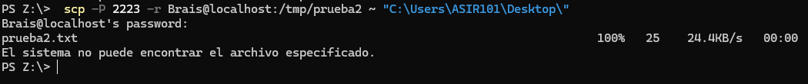
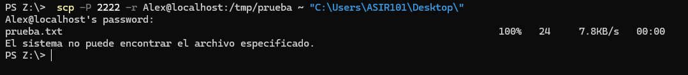

7. Creamos el directorio `prueba3` en el servidor con **200 archivos .txt** y lo transmitimos al escritorio del anfitrión.

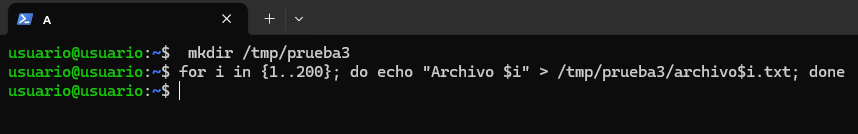
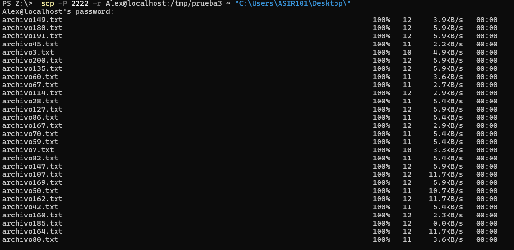

## Autenticación por Clave SSH

- Generamos un **par de claves SSH** en el cliente.

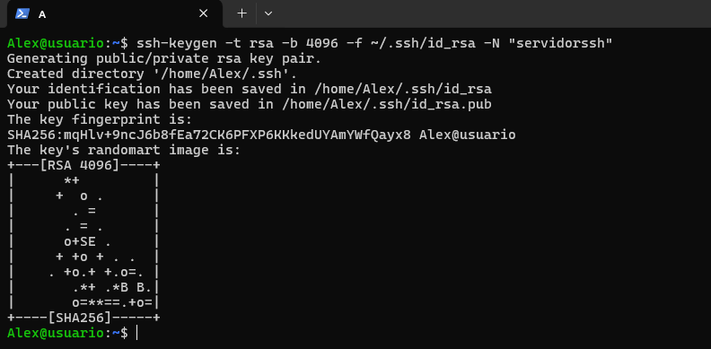

- Establecemos el passphrase: `servidorssh`.

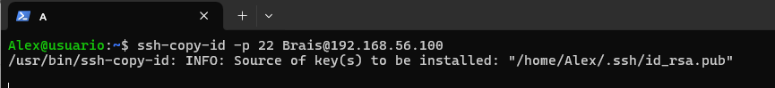

- Conectamos desde el usuario `Alex` en A hacia `Brais` en B usando la clave con passphrase `servidorssh`.
